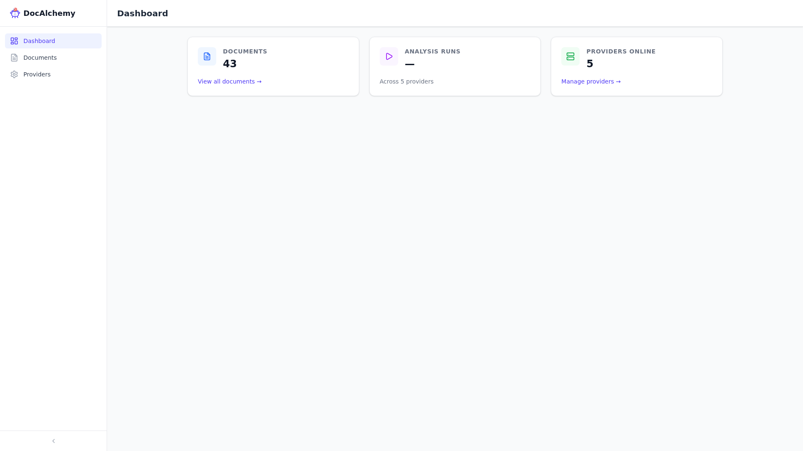
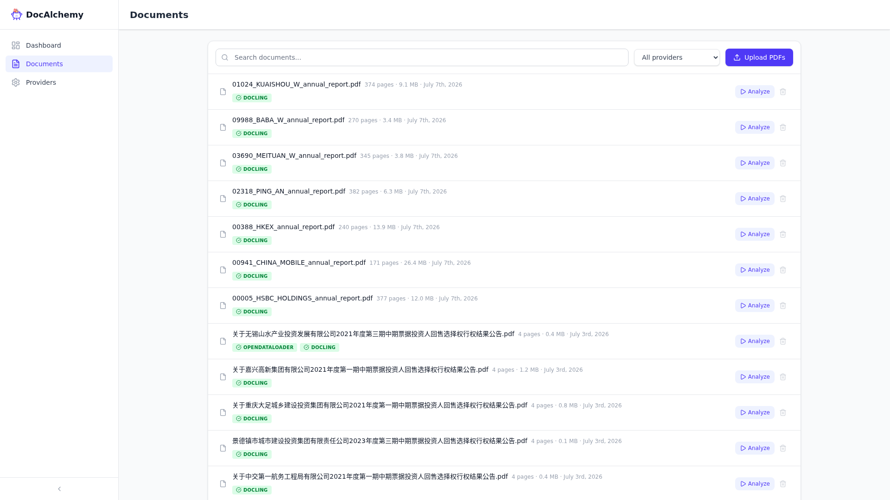
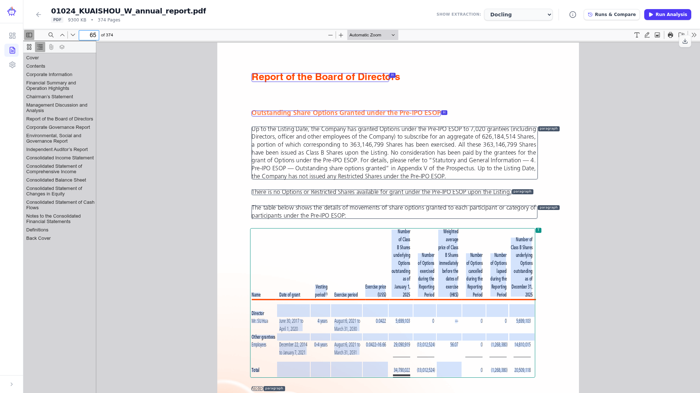
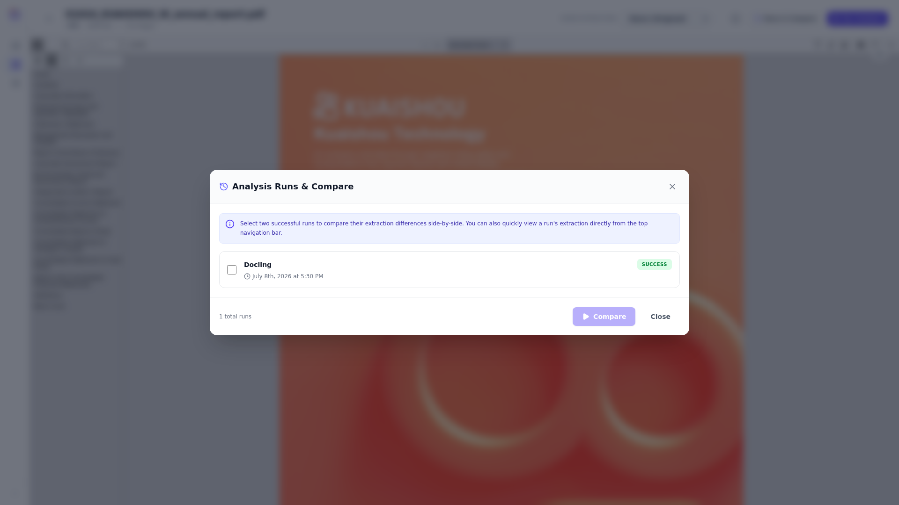
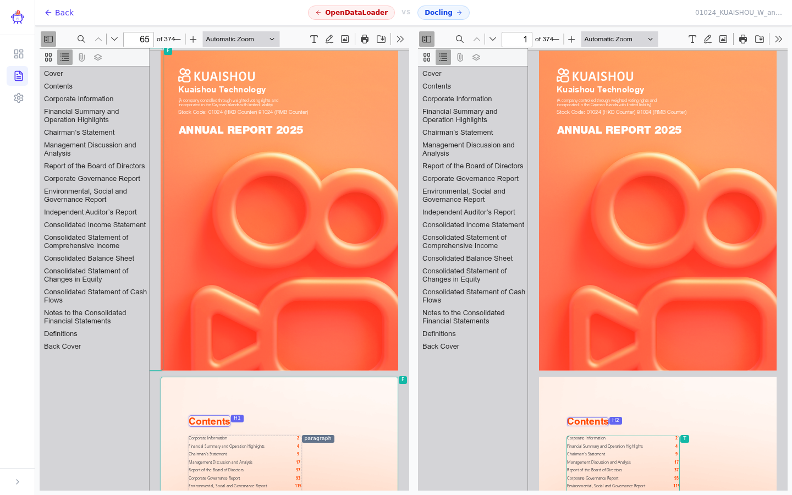
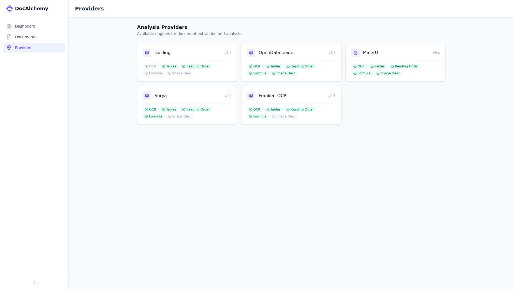

# DocAlchemy

[中文](README.zh.md)

> One document in. Every analysis engine's understanding of it, normalized and inspectable in one place.

## Why does this exist?

Document analysis is hard to trust. Today, anyone who needs to understand what a
document *actually contains* — an engineering team picking an OCR engine, a data
team building an ingestion pipeline, a researcher comparing extraction quality —
is forced to work across a landscape of providers that **do not speak the same
language**.

Each engine (Docling, MinerU, Surya, and many others) ships its own output
format, its own coordinate system, its own notion of a "block," a "table," a
"reading order." Evaluating even a single provider means staring at raw JSON,
writing throwaway scripts, and eyeballing screenshots. Comparing two providers
on the same file means doing all of that twice and holding the results in your
head. The real question — *which engine actually understands this document?* —
never gets a clean answer.

### Even rigorous benchmarks can't answer it

Public benchmarks have gotten serious.
[OmniDocBench](https://github.com/opendatalab/OmniDocBench) (CVPR 2025)
evaluates five parsing tasks — text OCR, table structure, formula recovery,
layout detection, reading order — across ~1,650 real-world PDFs spanning ten
document types, with expert human annotations and attribute-level breakdowns by
language, scan quality, and layout complexity. It is genuinely well-designed,
peer-reviewed, and better than anything that came before it.

It still can't answer your question, for four reasons:

**Your document isn't in it.** The benchmark dataset is fixed. Your contracts,
invoices, research reports, internal filings — none of them are there. An
aggregate score over ~1,650 curated pages tells you nothing specific about the
one document sitting in your pipeline today.

**Aggregate scores hide where things break.** Table TEDS = 0.78 across a
dataset could mean all tables are medium quality, or it could mean simple tables
score 0.95 while complex multi-column tables score 0.30. The failures that
matter most to you are exactly the ones that get averaged away.

**The metrics don't map to usefulness.** Normalized edit distance and tree edit
distance measure character-level and structural similarity to a ground-truth
annotation. They don't measure whether the extracted markdown is coherent enough
for an LLM to reason over, or whether the extracted table can be imported into a
database without manual cleanup. The gap between "scores well on NED" and "works
in my pipeline" can be large.

**Numbers don't show you the mistake.** A benchmark tells you a table extraction
scored 0.82. It doesn't tell you the engine collapsed columns 3 and 4. You can
see that in one glance when the extracted table is drawn over the original page.

OmniDocBench answers: *which engine is better on a curated academic distribution
of documents?* DocAlchemy answers: *which engine is better on this specific
document, and can I see why?*

### What replaces the leaderboard

The core idea is a **provider-neutral inspection layer for document
analysis**. Upload a source document once. Run it through as many analysis
engines as you like. DocAlchemy stores each engine's raw output, normalizes
every one of them into a single stable schema, and renders the results as
overlays on top of the **original** document — so the source PDF is always the
visual ground truth, and every provider is judged against the same baseline.

This matters because layout and structure quality is *qualitative first*. You
can read a hundred benchmark metrics about table extraction and still not know
whether an engine merged two columns on page 4. You can see it in a second when
the engine's extracted table is drawn over the real one. DocAlchemy turns
"trust the extraction" from a leap of faith into something you can look at.

In short: the document-analysis industry has no neutral ground for seeing what
its engines actually do — only leaderboards that flatten the truth away.
DocAlchemy builds that ground: one stable render contract, every provider
isolated and replaceable, the source document always at the center, and your
own eyes as the judge.

## What it does

- **Ingest once.** Upload a single source document; it is stored as the
  immutable visual baseline for every analysis.
- **Run many engines.** Dispatch the same source through multiple analysis
  providers — Docling, MinerU, Surya, OpenDataLoader, and FrankenOCR today;
  more behind a stable contract.
- **Normalize to one schema.** Each provider's native output is converted into
  an app-owned `RenderDocument` schema — one coordinate system, one block model,
  one way to render. The frontend never sees provider-native JSON.
- **Inspect over the real document.** Render normalized blocks, tables,
  reading order, and figures as overlays on the original PDF, so quality is
  judged visually against the source — not against a leaderboard. The viewer is
  powered by [document-viewer](https://github.com/Priestch/document-viewer),
  an open-source PDF viewing SDK maintained by the same author.
- **Track every run.** Provider name, version, config, latency, and raw
  artifacts are recorded for every analysis, so results are reproducible.

## Demo

A full walkthrough: dashboard → document list → enabling the Docling extraction
overlay on a financial table → the Runs & Compare dialog → providers page.

## Screenshots

### Dashboard

An at-a-glance view of documents ingested, analysis runs completed, and
providers currently online.



### Document list

Browse all uploaded source documents. Filter by provider, search by name,
upload new PDFs, or trigger a new analysis run in one click.



### PDF viewer with extraction overlay

The core inspection surface: the original PDF renders at full fidelity, and
each provider's extracted blocks are drawn over it as a coloured overlay —
text blocks, **table bounding boxes**, figures, and reading order. The
screenshot below shows Docling's table extraction on a financial page, with
green bounding boxes around each recognised table.

Switch providers in the **SHOW EXTRACTION** dropdown to compare results on
the same page without leaving the viewer.



### Analysis runs & compare

Track every run — provider, version, timestamp, latency, and status. Select
two successful runs to diff their extraction results side-by-side.



### Side-by-side comparison

Select any two runs and click **Compare** to open a split view — the same PDF
page rendered simultaneously for each provider, with each provider's extracted
blocks highlighted. Differences in table detection, heading classification, and
reading order become immediately apparent without toggling between runs.



### Providers

See which analysis engines are online and manage provider configuration.



## Getting started

### Prerequisites

| Tool | Purpose |
|------|---------|
| Docker & Docker Compose | Provider containers (sibling `docalchemy` repo) and infrastructure (PostgreSQL, Redis) |
| Sibling checkout of the [`docalchemy`](https://github.com/Priestch/docalchemy) repo | Provider containers + the `docalchemy` package the pack adapter imports |
| Python ≥ 3.11 + [PDM](https://pdm.fming.dev) | Backend dependencies |
| Node.js + [pnpm](https://pnpm.io) | Frontend dependencies |

### Setup

```bash
# 1. Clone and enter the repo
git clone https://github.com/Priestch/docalchemy.git
cd docalchemy

# 2. Copy and edit environment config
cp .env.example .env

# 3. Install Python and Node dependencies (also install the sibling package:
#    uv pip install -e ../docalchemy)
make install

# 4. Apply database migrations
make migrate

# 5. Start everything
make dev
```

`make dev` starts PostgreSQL and Redis (`docker-compose.infra.yml`), the four
provider containers (from the sibling `docalchemy` repo), one Celery pack
worker per provider on the host, then the Litestar backend and Vite dev
server.

```
Backend:   http://localhost:8000
Frontend:  http://localhost:5173
```

Stop all services: `make dev-stop`

### Provider workers

Each analysis engine runs in its own Docker container (from the `docalchemy`
repo, sharing `/home/gaopeng/localstorage/docalchemy` as `/storage`). On first
run, containers download and cache their model weights in Docker volumes —
this can be several gigabytes per provider and takes a while. Subsequent
starts reuse the cache. The pack workers are plain Celery processes on the
host; they need no images:

```bash
make dev-workers          # start the four host pack workers
```

### Useful make targets

| Target | Description |
|--------|-------------|
| `make dev` | Start everything |
| `make dev-stop` | Stop everything |
| `make dev-infra` | Start only PostgreSQL and Redis |
| `make dev-backend` | Start only the backend |
| `make dev-frontend` | Start only the frontend dev server |
| `make migrate` | Apply database migrations |
| `make test` | Run tests |
| `make lint` | Run linters |

## How it's organized

DocAlchemy is a pragmatically-DDD Python backend (Litestar) plus a React/Vite
viewer, with provider runtimes isolated behind a single contract.

- **Ingestion** — file upload and source storage.
- **Orchestration** — provider selection, job dispatch (Celery), retries, and
  run-status tracking.
- **Provider runtimes** — each engine runs in its own isolated environment with
  its own dependencies, behind the provider contract.
- **Normalization & rendering** — converts provider output into the
  `RenderDocument` schema and serves it to the viewer.

The one rule that keeps this coherent: **the application owns a single stable
render schema.** Providers come and go; the schema — and the viewer built on
it — stays.

## Documentation

Detailed design lives in [`docs/`](docs/):

- [Architecture handoff](docs/ARCHITECTURE_HANDOFF.md)
- [RenderDocument schema](docs/specs/RENDER_DOCUMENT_SCHEMA.md)
- [Provider contract](docs/specs/PROVIDER_CONTRACT.md)

## Powered by document-viewer

The inspection experience — rendering the source PDF and drawing normalized
provider overlays on top of it — is built on
[**document-viewer**](https://github.com/Priestch/document-viewer), an
open-source PDF viewing SDK maintained by the same author. DocAlchemy is both a
user of that SDK and a showcase for what a viewer becomes when it's treated as
an *inspection tool* for document intelligence rather than just a renderer.

## Status

Early. Multi-provider ingestion, normalization, and viewer overlays work; this
is not yet a released product. Expect breaking changes until a first tag.
